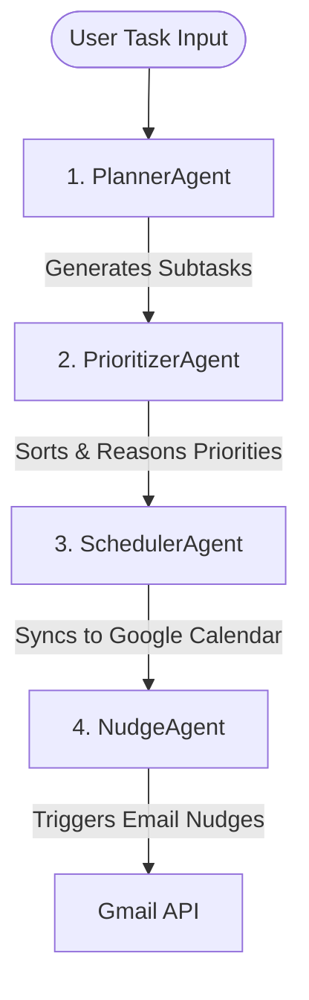

# ⏰ ZeroHour — Multi-Agent AI Productivity Companion

**ZeroHour** is a premium, multi-agent AI task management and crisis-response companion built for the **Vibe2Ship Hackathon (CodingNingasXGoogle)**. It helps professionals, students, and developers navigate tight deadlines, manage task priorities, sync with Google Calendar, and resolve time-crunches through an interactive, multimodal **Panic Mode**.

---

## 🚀 Live Production Links
*   🌐 **Deployable Link (Hosted on Google Cloud)**: [https://zerohour-a84d3.web.app](https://zerohour-a84d3.web.app)
*   ⚙️ **Backend API (Hosted on Railway)**: `https://mindful-nourishment-production-3ec0.up.railway.app`

---

## 🧠 Core Architecture: The 4-Agent Pipeline

ZeroHour orchestrates a pipeline of four specialized AI agents to automate task management:



1.  **PlannerAgent**: Breaks down complex tasks and deadlines into bite-sized, actionable subtasks with estimated durations.
2.  **PrioritizerAgent**: Analyzes the subtasks alongside the user's workload to dynamically assign logical execution priorities.
3.  **SchedulerAgent**: Evaluates the user's calendar constraints and automatically creates calendar slots via the **Google Calendar API**.
4.  **NudgeAgent**: Monitores upcoming deadlines in real-time and sends customized email alerts via the **Gmail API** to prevent procrastination.

---

## 🚨 Panic Mode: Crisis Management Flow
When users face a sudden crunch, **Panic Mode** acts as their virtual Chief of Staff:
*   **Multimodal Attachment Analysis**: Upload syllabi, PDFs, or photos of assignments. ZeroHour's multimodal Gemini engine processes the content to extract milestones and deadlines instantly.
*   **Gemini-Style History Sidebar**: Manage past crisis conversations. Easily create new chats, reload history, rename sessions inline, or delete logs.
*   **Real-Time Agent Streams**: Watch the agents think, plan, and schedule live through Server-Sent Events (SSE).
*   **Task Crisis Overwrite**: Trigger Panic Mode on an existing task to overwrite its subtasks and calendar events automatically rather than creating duplicates.

---

## 🆕 Pacing, Personalization & CRUD Customization
We introduced deep customization and flexible calendar pacing:
*   **30-Day Session Persistence**: Hardened session cookie max-age to 30 days so users remain logged in across browser sessions.
*   **Custom Work/Focus Hours**: Define custom sleep/wake hours on the Settings page to restrict scheduling to your active window.
*   **Smart Calendar Pacing & Breaks**: Spacers distribute task blocks evenly over days, inject **10-minute breaks** between consecutive blocks, and shift late-night tasks to the next morning.
*   **Two-Way Calendar Pull-Sync**: Click the "Sync Calendar" button on any task details page to fetch latest titles and timings directly from Google Calendar.
*   **Manual Subtask CRUD**: Add, edit, or delete plan milestones manually with automatic parent task status and progress recalculations.
*   **Mobile Bottom Navigation Bar**: SLEEK native bottom navigation bar for mobile screens, giving quick access to Core, Calendar, Panic, Settings, and Exit controls.

---

## 🛡️ Security Hardening & Best Practices
*   **CORS/Adblock Immune Brand Logos**: Logos for Gemini, Calendar, Firebase, Drive, Gmail, and Meet are embedded as inline vector SVGs to prevent browser-level network blocking.
*   **Programmatic CORS Wildcard Origin Patterns**: Enforces allowed origin patterns (`*`) in Spring Security while keeping credentials enabled, resolving cross-domain preflight blockages on mobile and desktop devices.
*   **50MB Request Payload Ingestion**: Configured Tomcat and Spring servlet parameters to accept up to 50MB PDF/image syllabus uploads.
*   **Automatic Fallback API Resolution**: Integrated automatic Railway URL API fallback in the frontend `api.js` to ensure production calls resolve correctly regardless of compilation environment variables.
*   **Public Legal Routes**: Registered public React Router paths `/about`, `/privacy`, `/terms`, and `/security` with matching WebSecurity customizers.
*   **Bypassed Third-Party Cookie Redirect Logout Loop**: Implemented a robust direct GET/POST redirect logout handler to prevent CORS/CSRF blockages on session invalidations.
*   **CSRF Protection**: Spring Security generates double-submitted CSRF tokens stored in a secure cookie (`XSRF-TOKEN`) and validated on all mutating requests (disabled in production cross-domain mode for seamless API integration).
*   **IDOR Mitigation**: Added resource ownership validation checks on all REST endpoints (e.g. notifications and task updates).
*   **Native JNI Alpine Segfault Fix**: Switched JRE base images to standard glibc Debian JRE to resolve `netty-tcnative` JNI segmentation faults.

---

## 💻 Local Development Setup

### Backend (Spring Boot)
1. Navigate to the backend folder:
   ```bash
   cd backend
   ```
2. Configure your environment variables in `.env` (or let it fallback to default values):
   ```properties
   GOOGLE_CLIENT_ID=your-client-id
   GOOGLE_CLIENT_SECRET=your-client-secret
   GEMINI_API_KEY=your-gemini-key
   ```
3. Run the backend:
   ```bash
   mvn spring-boot:run
   ```

### Frontend (React)
1. Navigate to the frontend folder:
   ```bash
   cd frontend
   ```
2. Install dependencies and start the Vite dev server:
   ```bash
   npm install
   npm run dev
   ```
